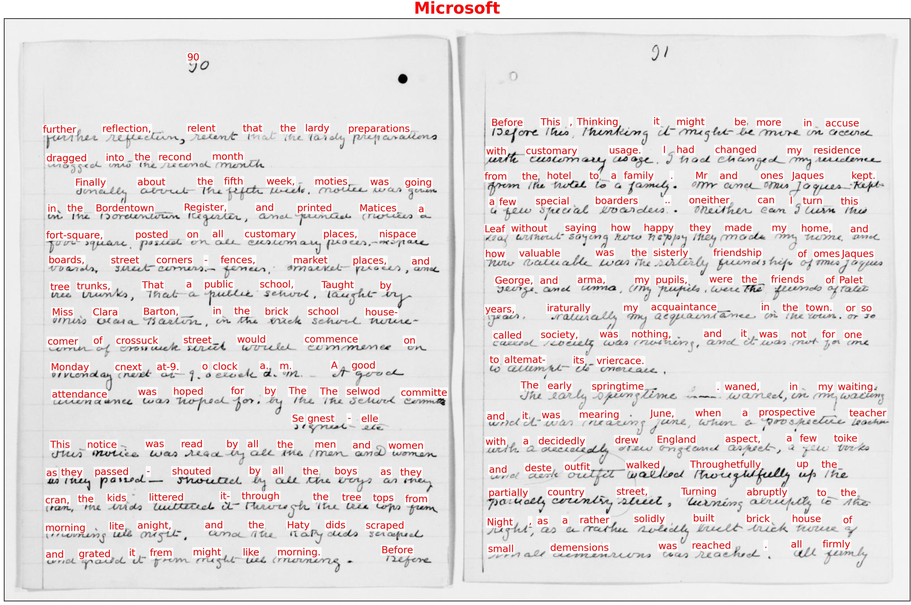

# Basic Handprint usage

If the installation steps described in the previous section proceed successfully, a command-line program named `handprint` should end up installed in a location where software is normally installed on your computer.  Running `handprint` from a terminal shell then should be as simple as running any other shell command on your system:

```bash
handprint -h
```

If that fails for some reason, you should be able to run `handprint` from anywhere using the normal approach for running Python modules:

```bash
python3 -m handprint -h
```

The `-h` option (`/h` on Windows) will make `handprint` display some help information and exit immediately.  To make Handprint do more, you can supply other arguments that instruct `handprint` to process image files (or alternatively, URLs pointing to image files at a network location) and run text recognition algorithms on them, as explained below.


## Installing credentials

Handprint includes several adapters for working with cloud-based HTR services from Amazon, Google, and Microsoft, but _does not include credentials for using the services_.  Before you can use Handprint, you must supply credentials for accessing the cloud services you want to use. The process for doing this involves using the `-a` option (`/a` on Windows) and is described in detail in the section [Configuration for cloud services](configuration.md).


## Input files and URLs

After credentials are installed, running Handprint _without_ the `-a` option will invoke one or more services on files, directories of files, or URLs pointing to files. Here is an example of running Handprint on a directory containing images:
```sh
handprint tests/data/caltech-archives/glaser/
```

Image paths or URLs can be supplied to Handprint in any of the following ways:
* One or more directory paths or one or more image file paths on the local disk, which will be interpreted as images (either individually or in directories) to be processed
* One or more URLs, which will be interpreted as network locations of image files to be processed
* If given the `-f` option (`/f` on Windows), a file containing either image paths or image URLs to be processed

For every input given as a URL, Handprint will first download the image found at the URL to a directory indicated by the option `-o` (`/o` on Windows), or the current directory if option `-o` is not used.

No matter whether files or URLs, each input item should be a single image of a document page in which text should be recognized.  Handprint reads a number of common formats: JP2, JPEG, PDF, PNG, GIF, BMP, and TIFF.  However, for simplicity and maximum compatibility with all cloud services, Handprint always **converts all input files to PNG** if they are not already in that format, no matter if a given service can accept other formats.  Handprint also **reduces the size** of input images to the smallest size accepted by any of the services invoked if an image exceeds that size.  (For example, when sending a file to services A and B at the same time, if service A accepts files up to 10 MB in size and service B accepts files up to 4 MB, Handprint will resize the file to 4 MB before sending it to _both_ A and B, even if A could accept a higher-resolution image.)  Finally, if the input contains more than one page (e.g., in a PDF file), Handprint will **only use the first page of the input** and ignore the remaining pages.

Be aware that **downsizing images can change the text recognition results returned by some services** compared to the results obtained using the original full-size input image.  If your images are larger when converted to PNG than the smallest size accepted by one of the destination services (currently 4 MB, for Microsoft), then you may wish to compare the results of using multiple services at once versus one at a time (i.e., one destination at a time in separate invocations of Handprint).

Finally, note that providing URLs on the command line can be problematic due to how terminal shells interpret certain characters, and so when supplying URLs, it's usually better to store the URLs in a file in combination with the `-f` option (`/f` on Windows).


## Selecting destination services

You can use the `-l` option (`/l` on Windows) to make it display a list of the services currently supported by Handprint:

```sh
# handprint -l
Known services: amazon-rekognition, amazon-textract, google, microsoft
```

By default, Handprint will send images to all of the known services, creating annotated images to represent the results of each individual service.  To invoke only specific services, use the `-s` option (`/s` on Windows) followed by a service name or a list of names separated by commas (e.g., `google,microsoft`).  For example, the following command will invoke Microsoft's text recognition service on a page from [Clara Barton's unpublished draft book "The Life of My Childhood"](https://picryl.com/media/clara-barton-papers-speeches-and-writings-file-1849-1947-books-the-life-of-71), available in Handprint's source directory:
```sh
handprint -s microsoft tests/data/public-domain/images/clara-barton-life-of-my-childhood-p90.jpg
```

Here is the result of that command:
<p align="center">

</p>


## Visual display of results

After gathering the results of each service for a given input, Handprint will create a single compound image consisting of the results for each service arranged in a _N_&times;_N_ grid.  This overview image is intended to make it easier to compare the results of multiple services against each other.  The grid image will have the suffix `.handprint-all.png`.  Here is a sample output image to illustrate:

<p align="center">

</p>

The 2&times;2 image above was produced by running the following command from the Handprint `tests/data/caltech-archives/glaser` directory:
```csh
handprint --text-size 20  "DAG_5_1_6 1952-1957 Notebook VI p2.jpg"
```

To move the position of the text annotations overlaid over the input image, you can use the option `-m` (or `/m` on Windows).  This takes two numbers separated by a comma in the form `x,y`.  Positive numbers move the text rightward and upward, respectively, relative to the default position.  The default position of each text annotation in the annotated output is such that the _left edge of the word_ starts at the location of the _upper left corner of the bounding box_ returned by the service; this has the effect of putting the annotation near, but above, the location of the (actual) word in the input image by default.  For example, if the word in the image is _strawberry_, the bounding box returned by the service will enclose _strawberry_, and the upper left corner of that bounding box will be somewhere above the letter _s_. Then, the default position of the text annotation will put the left edge of the word "strawberry" at that point above the letter _s_. Using the move-text option allows you to move the annotation if desired. A value such as `0,-5` will move it downward five pixels.

To change the color of the text annotations overlaid over the input image, you can use the option `-x` (or `/x` on Windows).  You can use hex color codes such as `"#ff0000"` (make sure to enclose the value with quotes, or the shell will interpret the pound sign as a comment character), or X11/CSS4 color names with no spaces such as `purple` or `darkgreen`.

To change the size of the text annotations overlaid over the input image, you can use the option `-z` (or `/z` on Windows).  The value is in units of points.  The default size is 12.

Finally, the individual results, as well as individual annotated images corresponding to the results from each service, will not be retained unless the `-e` extended results option (`/e` on Windows) is invoked (described in more detail below).  The production of the overview grid image can be skipped by using the `-G` option (`/G` on Windows).
