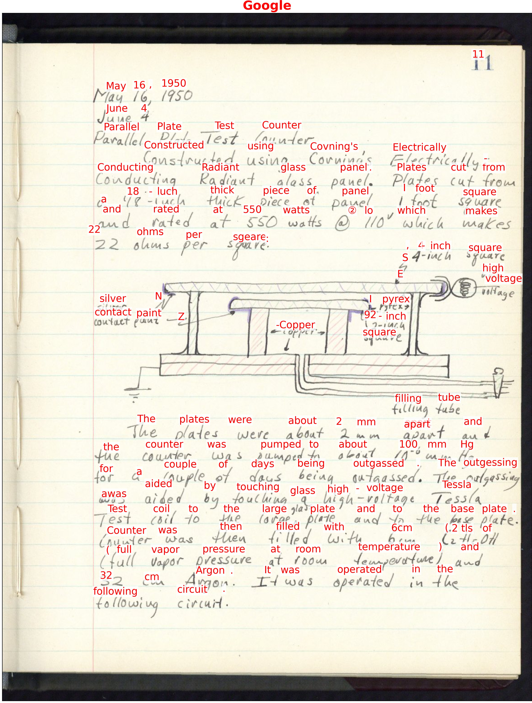

# Handprint

The _**Hand**written **p**age **r**ecognit**i**o**n** **t**est_ is a command-line program that invokes HTR (handwritten text recognition) services on images of document pages.  It can produce annotated images showing the results, compare the recognized text to expected text, save the HTR service results as JSON and text files, and more. It can be applied to any images of text documents. The images can come from your local computer's disk or from web locations.

Handprint currently supports Google's [Google Cloud Vision API](https://cloud.google.com/vision/docs/ocr), Microsoft's Azure [Computer Vision API](https://azure.microsoft.com/en-us/services/cognitive-services/computer-vision/), and Amazon's [Textract](https://aws.amazon.com/textract/) and [Rekognition](https://aws.amazon.com/rekognition/). (To use the services, you need to provide suitable account credentials.)

Handprint is written in Python. Ready-to-run executables are available for some operating systems; you can also install Handprint using common Python installation frameworks such as `pipx` and `pip`.

## Sections

```{toctree}
---
maxdepth: 2
---
installation.md
configuration.md
basic-usage.md
advanced-usage.md
command-summary.md
known-issues.md
colophon.md
```
